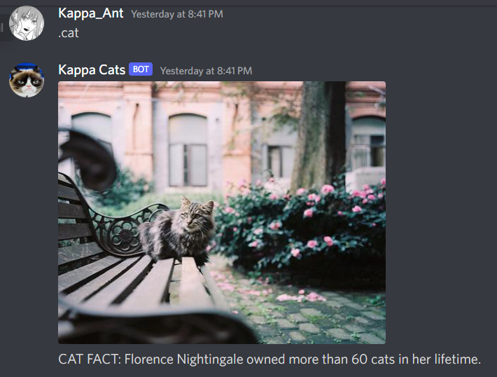
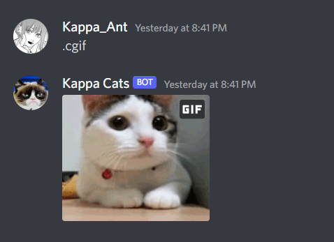

APIS:

https://api.thecatapi.com/v1/images/search

https://catfact.ninja/fact?max_length=140

https://cataas.com/cat/gif

(and discord bot API)

Summary of Program: Shows user random pics of cats and generates a random cat fact, also displays cat gifs from the web!

Commands:

.cat - picture and a fact

* 

.catgif - gif video

* 

Note: This bot runs on Heroku for free and will shut off every other month. 
      *Token protected using environment variables on Heroku
